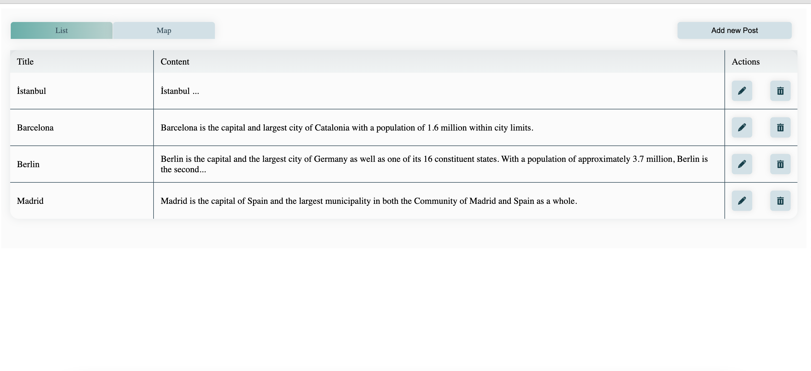

# A Simple Map App With React
## Heroku
https://wefox-frontend-challenge-app.herokuapp.com/

## Introduction

This project was bootstrapped with [Create React App]
(https://github.com/facebook/create-react-app).

## Features
    View posts data from  Data Table and Map
    Edit and delete post data from Data table
    Add new post
    View post data details via click the marker inside map

## Technologies
 React 18.2.0

Open Layer [openlayer](https://openlayers.org/)

 ## ScreenShots
 
  
  

## Running Instructions

In the project directory, you can run:

### `npm install`

### `npm start`

Once runs the app in the development mode.\
Open [http://localhost:3001](http://localhost:3000) to view it in the browser.

